# MAPS 주식자동화 시스템 AS-IS 프로세스 분석서

> 본 문서는 **현재 구현된 Python 코드만을 근거로** 작성된 역분석(AS-IS) 문서다.
> 신규 설계·리팩토링·개선안은 본문에 포함하지 않으며, 개선 아이디어는 마지막 "개선 후보" 섹션에만 분리한다.
> 코드로 확인되지 않는 항목은 **"확인 필요"** 로 명시했다.

---

## 0. 문서 개요

| 항목 | 내용 |
|---|---|
| 분석 대상 | MAPS (Market-Adaptive Profit Management System) — 검증 중심 한국주식 자동매매 플랫폼 |
| 분석 기준 | 저장소 `master` 브랜치 현재 코드 (FastAPI 0.2.0) |
| 분석 방법 | 진입점 → 오케스트레이터 → 도메인 모듈 정적 역분석 |
| 비실행 원칙 | 실제 주문·실 API 호출·DB 변경 없이 코드만 분석 |
| 민감정보 | `.env`/API Key/Secret/Token 값은 본 문서에 미포함 (변수명만 기재) |

### 분석 한계 (코드만으로 확정 불가 — 상세는 §9.4)

- 실제 주문 실행 여부는 **런타임 `.env` 값**(`MAPS_LIVE_TRADING_ENABLED`, `MAPS_BROKER_MODE`, `KIS_REAL_TRADING`, `MAPS_DRY_RUN`)에 의존 → 현재 운영값 미확인
- 증권사/DART/Bedrock 실제 자격증명·응답 데이터 미확인
- 스케줄러 실제 가동 여부(`MAPS_SCHEDULER_ENABLED`) 런타임 의존

---

## 1. 시스템 개요 및 실행 진입점

### 1.1 애플리케이션 진입점

| 구분 | 파일 | 함수/클래스 | 역할 |
|---|---|---|---|
| 메인 / API 서버 | `main.py` | `app = FastAPI(...)`, `_lifespan()` | 유일 진입점. `uvicorn main:app`. 라우터 20개 등록, 정적/템플릿 마운트 |
| 스케줄러 | `maps/ops/scheduler.py` | `MapsOperationalScheduler`, `start_operational_scheduler_if_enabled()` | `_lifespan`에서 조건부 기동(APScheduler) |
| 배치/백필 | `maps/ops/scheduler.py` | `backfill_ohlcv()`, `backfill_fundamentals()`, `run_once()` | 별도 배치 스크립트 없음. API·메서드로 수동 실행 |
| DB 마이그레이션 | `alembic/versions/*` (9개) | Alembic | `alembic upgrade head` |
| CLI / `run.py` / `app.py` | (없음) | — | **확인 필요** — root에 `main.py`만 존재, 독립 CLI 미확인 |

`main.py:_lifespan()` 기동 순서 (코드 기준):
1. `configure_logging()` (모듈 로드 시점, `main.py:18`)
2. 트레이딩 모드 배너 로그 (`describe_trading_mode`)
3. **실거래 안전가드**: `real_trading_unconfirmed(settings)` 참이면 `RuntimeError`로 기동 거부 (`main.py:63-69`)
4. `Base.metadata.create_all(bind=engine)` — 전체 테이블 생성
5. `start_operational_scheduler_if_enabled()` — `MAPS_SCHEDULER_ENABLED=true`일 때만 스케줄러 시작
6. 종료 시 `shutdown_operational_scheduler()`

등록 라우터(20): dashboard, strategies, market, candidates, orders, risk, backtest, robustness, trend_strength, research, wfa, cost_sensitivity, live_monitor, data_quality, ops_config, scheduler, stock_report, mobile, trade_review, stock_analysis (`main.py:100-119`).

### 1.2 Python 실행 환경

| 파일 | 내용 |
|---|---|
| `requirements.txt` | fastapi, uvicorn[standard], sqlalchemy≥2.0, alembic, psycopg2-binary, pydantic≥2.7, pydantic-settings, jinja2, **apscheduler**, **pandas**, **numpy**, requests, **boto3**, **pykrx**, **yfinance**, pytest/pytest-asyncio/httpx, python-dateutil, **holidays** |
| `pyproject.toml` | `requires-python ≥3.11`, `pytest` `asyncio_mode="auto"`, `testpaths=["tests"]` |
| `Pipfile`/`poetry.lock`/`setup.py` | **미확인** (없음으로 보임) |

실행 방식 (CLAUDE.md 근거): `uvicorn main:app --reload [--port 8001]`.

### 1.3 프로젝트 패키지 구조 (`maps/`)

| 패키지 | 책임 |
|---|---|
| `common/` | `settings.py`(pydantic-settings), `db.py`(SQLAlchemy), `models.py`(ORM 18테이블), `constants.py`, `exceptions.py`, `logging_config.py` |
| `data/` | `collector.py`, `krx_adapter.py`, `ohlcv_repo.py`, `security_repo.py`, `fundamental_repo.py` |
| `data_quality/` | `universe_filter.py` — as-of-date 유니버스 생성기 |
| `indicator/` | `trend_strength.py` — TrendStrength 0~100 점수 + S1~S5 버킷 |
| `market/` | `regime.py`(장세), `sector_selector.py`(섹터), `trading_rules.py`(KRX 규칙) |
| `strategy/` | `base.py` + 전략 8종, `scoring.py`, `live_rules.py`, `price_calculator.py`, `holding_type.py` |
| `ai/` | `technical_scorer.py`, `contrarian_analyzer.py`, `valuation_margin.py` |
| `backtest/` | `engine.py`, `cost_model.py`, `kostolany_*.py` |
| `validation/` | `walk_forward.py`, `plateau.py`, `monte_carlo.py` |
| `promotion/` | `gate.py` — 승격 결정 |
| `execution/` | `broker_adapter.py`(ABC), `mock_broker.py`, `kis_adapter.py`, `kiwoom_adapter.py`, `order_manager.py` |
| `risk/` | `manager.py` — Kill Switch + 노출 한도 |
| `ops/` | `scheduler.py`, `notifications.py`, `order_state.py`, `order_preview.py`, `reconciliation.py`, `report_generator.py` |
| `stock_report/` | `runner.py` — 외부 stock-report 연동 |
| `stock_analysis/` | `analyzer.py` — pykrx + DART 종목 종합분석 |
| `api/` | 화면별 라우터 + `deps.py`, `schemas.py` |
| `dashboard/` | `strategy_compare.py` |

### 1.4 일일 스케줄 파이프라인 개관 (KST)

`MapsOperationalScheduler._register_jobs()` (`scheduler.py:2227-2254`) 기준:

| 잡 ID | 트리거 | 기본 시각/주기 | 메서드 |
|---|---|---|---|
| `data_collection` | Cron(mon-fri) | `16:10` (`maps_data_collection_time`) | `OperationalPipeline.collect_data` |
| `candidate_generation` | Cron(mon-fri) | `16:20` (`maps_candidate_time`) | `generate_candidates` |
| `validation` | Cron(mon-fri) | `16:40` (`maps_validation_time`) | `run_validation` |
| `order_cycle` | Cron(mon-fri) | `08:55` (`maps_order_time`) | `run_order_cycle` |
| `broker_sync` | Interval | `60초` (`maps_broker_sync_interval_seconds`, ≥10) | `sync_broker_state` |
| `eod_cleanup` | Cron(mon-fri) | `15:35` (`maps_eod_time`) | `run_eod_cleanup` |
| `stock_report` | Cron(매일) | `15:00` (`maps_stock_report_time`) | `_run_stock_report` |

- 모든 weekday 잡과 `broker_sync`는 `_make_krx_job()`으로 감싸져 **KRX 비거래일이면 실행 스킵**(`_is_krx_market_day()` 캐시). (`scheduler.py:2214-2225`)
- `stock_report`만 주말 포함 매일 실행.

---

## 2. 프로세스별 상세 분석

> 표준 형식: 개요 / 처리 흐름 / 관련 코드 / 입력 / 출력 / DB / 외부연계 / 의사결정 / 예외 / 운영확인 / Mermaid

---

### 2.1 시장 데이터 수집 프로세스

#### 1. 프로세스 개요
- **목적**: ref_date 하루치 OHLCV·종목메타·정지/관리종목·펀더멘털을 수집해 DB 적재.
- **시작 조건**: 스케줄러 `data_collection` 잡(16:10) 또는 API `POST /scheduler/run/data_collection`.
- **종료 조건**: `collection_log`에 success/failed 기록.
- **실행 방식**: scheduler(주력) / manual(API).
- **관련 시스템**: KRX(pykrx).

#### 2. 코드 기준 처리 흐름
1. `MapsOperationalScheduler` → `OperationalPipeline.collect_data(ref_date)` (`scheduler.py:199`)
2. `_make_krx_adapter()` — `maps_data_provider=="mock"`이면 `MockKRXAdapter`, 아니면 `KRXAdapter` (`scheduler.py:651-654`)
3. `DataCollector.collect_daily(ref_date)` (`collector.py:48`)
4. `get_ohlcv` / `get_security_meta` / `get_halt_list` / `get_managed_list` / `get_sector_classifications` / `get_fundamental` 호출
5. `_upsert_meta` → `security_metadata`, `_upsert_ohlcv` → `historical_ohlcv`(양수 검증), `_upsert_fundamentals` → `security_fundamental`
6. `_write_log` → `collection_log`

#### 3. 관련 코드
| 구분 | 파일 | 클래스 | 함수 | 역할 |
|---|---|---|---|---|
| Entry | `ops/scheduler.py` | `OperationalPipeline` | `collect_data` | 잡 래핑 |
| Logic | `data/collector.py` | `DataCollector` | `collect_daily`, `_upsert_*` | 수집·적재 |
| Adapter | `data/krx_adapter.py` | `KRXAdapter`/`MockKRXAdapter` | `get_ohlcv` 등 | 외부 데이터 |
| DB | `common/models.py` | — | — | `historical_ohlcv`, `security_metadata`, `security_fundamental`, `collection_log` |

#### 4. 입력 데이터
- `ref_date`(date), `maps_data_provider` 설정, pykrx OHLCV/메타/펀더멘털 응답.

#### 5. 출력 데이터
- `CollectionResult`(ohlcv/meta/halts/managed), DB upsert 건수, `collection_log` 행.

#### 6. 데이터 저장 및 DB 처리
- 테이블: `historical_ohlcv`(ticker+date upsert), `security_metadata`(ticker upsert), `security_fundamental`(ticker+date upsert), `collection_log`(append).
- 저장 조건: OHLCV는 `_is_valid_ohlcv`(open/high/low/close>0, volume≥0) 통과분만. 펀더멘털은 per/pbr/eps/bps 중 하나라도 not None.
- 트랜잭션: 메서드별 `db.commit()`. 수집 실패 시 `collect_daily`가 `failed` 로그 후 `DataCollectionError` 재전파.

#### 7. 외부 연계
| 외부 | 호출 | 요청 | 응답 | 실패 처리 |
|---|---|---|---|---|
| KRX(pykrx) | `KRXAdapter.get_ohlcv/meta/...` | ref_date | OHLCV/메타 | 업종·펀더멘털 수집 실패는 경고 후 스킵(빈값); 전체 실패는 `DataCollectionError` |

#### 8. 의사결정 로직
- 수정주가 누락 + broker 존재 시 폴백 경고만(Phase 4 미구현, `collector.py:62-64`).
- mock/실데이터 분기: `maps_data_provider`.

#### 9. 예외 처리
| 예외 | 위치 | 처리 | 로그 | 재처리 |
|---|---|---|---|---|
| 업종/펀더멘털 수집 실패 | `collect_daily` | 경고 후 빈값 | warning | 다음 수집 |
| 전체 수집 실패 | `collect_daily` | `failed` 로그 + 예외 | log+예외 | 잡 재실행 |

#### 10. 로그 및 운영 확인 포인트
- `collection_log` (source=`krx`/`krx.history`/`krx.fundamental`), 로그 메시지 "수집 시작/실패".
- 백필: `collect_ohlcv_history`, `collect_fundamental_history`.

#### 11. Mermaid
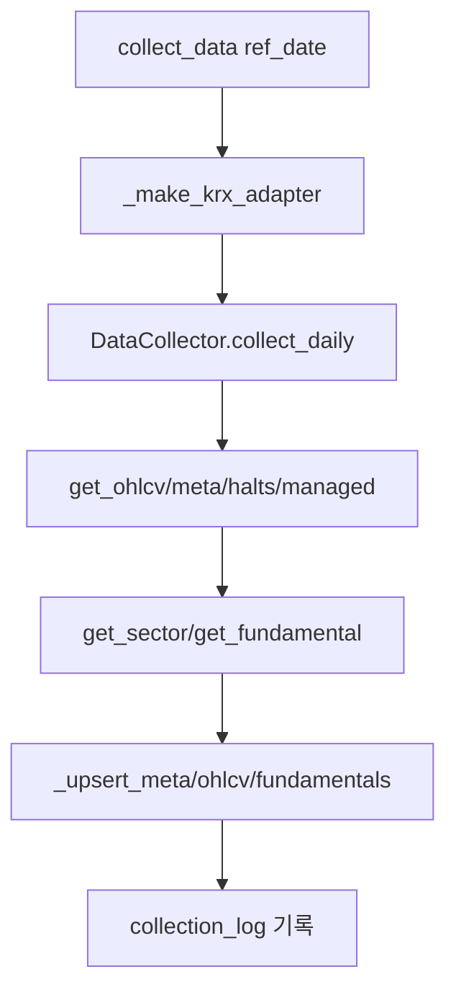

---

### 2.2 시황(장세) 판단 프로세스

#### 1. 프로세스 개요
- **목적**: MarketRegime × WeeklyTrend × VolRegime 매트릭스로 진입 한도 비율 산정.
- **시작 조건**: `generate_candidates`·`run_order_cycle` 내부에서 `_analyze_regime()` 호출.
- **실행 방식**: scheduler 내부 호출 / API `GET /market/regime`.

#### 2. 코드 기준 처리 흐름
1. `OperationalPipeline._analyze_regime()` (`scheduler.py:1972`)
2. `create_regime_analyzer(settings)` (`regime.py:722`) — override가 "auto"가 아니면 즉시 override 결과, 아니면 `CombinedWeeklyProvider`(pykrx+yfinance)
3. `MarketRegimeAnalyzer.analyze()` → `_compute()`: 8개 자산 5주MA 상회 비율로 strong/mixed/weak, `_check_weekly_trend()`(MA10>MA20>MA40), `_compute_vol_regime()`(KOSPI 20주 연환산 변동성)
4. 실패 시 `_analyze_regime`이 **WEAK+FAIL(진입 차단)** 폴백 반환

#### 3. 관련 코드
| 구분 | 파일 | 클래스 | 함수 |
|---|---|---|---|
| Logic | `market/regime.py` | `MarketRegimeAnalyzer` | `analyze`, `_compute`, `entry_limit_ratio`, `entry_policy_for_strategy` |
| Provider | `market/regime.py` | `CombinedWeeklyProvider` | `get_weekly_closes` |
| Factory | `market/regime.py` | — | `create_regime_analyzer` |

#### 4. 입력 데이터
- pykrx 국내 지수(KOSPI/KOSDAQ), yfinance 해외(S&P500, NASDAQ, USD/KRW, 금, WTI, 구리) 주봉 종가.
- 설정 override: `MAPS_MARKET_REGIME_OVERRIDE`, `MAPS_WEEKLY_TREND_OVERRIDE`, `MAPS_KOSTOLANY_REGIME_ENABLED`.

#### 5. 출력 데이터
- `RegimeResult`(regime, weekly_trend, vol_regime, kospi_ts, entry_limit_ratio 프로퍼티, composite?).

#### 6. 데이터 저장 및 DB 처리
- **DB 미저장**(in-memory 계산). 후보 생성 결과 details에 regime 값이 잡 로그로만 남음. → 영속 저장은 **확인 필요**.

#### 7. 외부 연계
| 외부 | 호출 | 실패 처리 |
|---|---|---|
| pykrx | `_from_krx` | 빈 리스트 → 해당 자산 flat |
| yfinance | `_from_yfinance` | 빈 리스트 → flat |

#### 8. 의사결정 로직 (코드 임계값)
- 장세: up_ratio ≥0.7 STRONG / ≥0.4 MIXED / <0.4 WEAK (`regime.py:602-608`)
- WeeklyTrend: `MA10>MA20>MA40` → PASS, 아니면 FAIL
- VolRegime: 연환산<12% LOW / >20% HIGH / 그외 NORMAL
- `entry_limit_ratio`: FAIL→0.0; STRONG 1.0/MIXED 0.5/WEAK 0.25, HIGH면 1단계 하향(WEAK+HIGH→0.0)
- `entry_policy_for_strategy`: 전략유형별 추가 허용/제한 (예: WEAK에서 BREAKOUT 차단, WEAK+HIGH는 CONTRARIAN_QUALITY만 제한 허용)

#### 9. 예외 처리
| 예외 | 위치 | 처리 |
|---|---|---|
| 분석 전체 실패 | `_analyze_regime` | WEAK+FAIL 폴백(진입 차단) |
| provider 데이터 부족 | `_compute_vol_regime`/`_check_weekly_trend` | NORMAL/PASS 기본값 |

#### 10. 운영 확인 포인트
- 잡 로그 "시황 분석: regime=… trend=… entry_limit=…".

#### 11. Mermaid
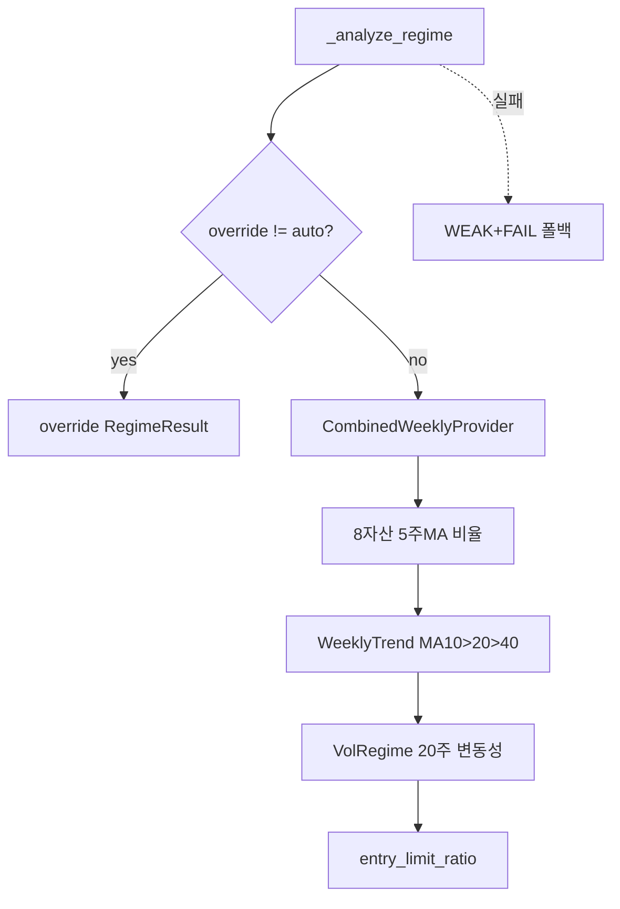

---

### 2.3 업종/섹터 분석 프로세스

#### 1. 개요
- **목적**: 강세 업종 선정 후 유니버스를 해당 섹터로 제한.
- **시작 조건**: `generate_candidates` 내부, `MAPS_SECTOR_FILTER_ENABLED=true`일 때만.

#### 2. 처리 흐름
1. `generate_candidates`에서 `maps_sector_filter_enabled` 확인 (`scheduler.py:246`)
2. `maps_sector_kostolany_mode_enabled` → `SectorRegimeSelector.select()`, 아니면 `SectorSelector.select_strong_sectors()`
3. 선택 섹터 외 종목은 `sector_excluded_reason_by_ticker`에 사유 기록 후 universe에서 제외

#### 3. 관련 코드
| 구분 | 파일 | 클래스 | 함수 |
|---|---|---|---|
| Logic | `market/sector_selector.py` | `SectorSelector`, `SectorRegimeSelector` | `select_strong_sectors`, `select` |
| Caller | `ops/scheduler.py` | `OperationalPipeline` | `generate_candidates` (255-295) |

#### 4~5. 입력/출력
- 입력: `db`, `ref_date`, `RegimeResult`, `maps_sector_lookback_days`, `maps_sector_top_n`.
- 출력: `strong_sectors`, `excluded_sectors`, `watchlist_sectors`, `sector_scores`, `overheated_sectors` → 잡 details.

#### 6. DB
- 섹터 정보는 `security_metadata.sector`. 선정 결과 별도 테이블 저장 **확인 필요**(잡 details에만 노출).

#### 8. 의사결정
- 비활성(`false`)이 기본값. 활성 시 강세 섹터 교집합으로 universe 축소.

#### 9~10. 예외/운영
- 잡 로그 "업종 필터 적용: N→M종목(강세업종=…)".

#### 11. Mermaid
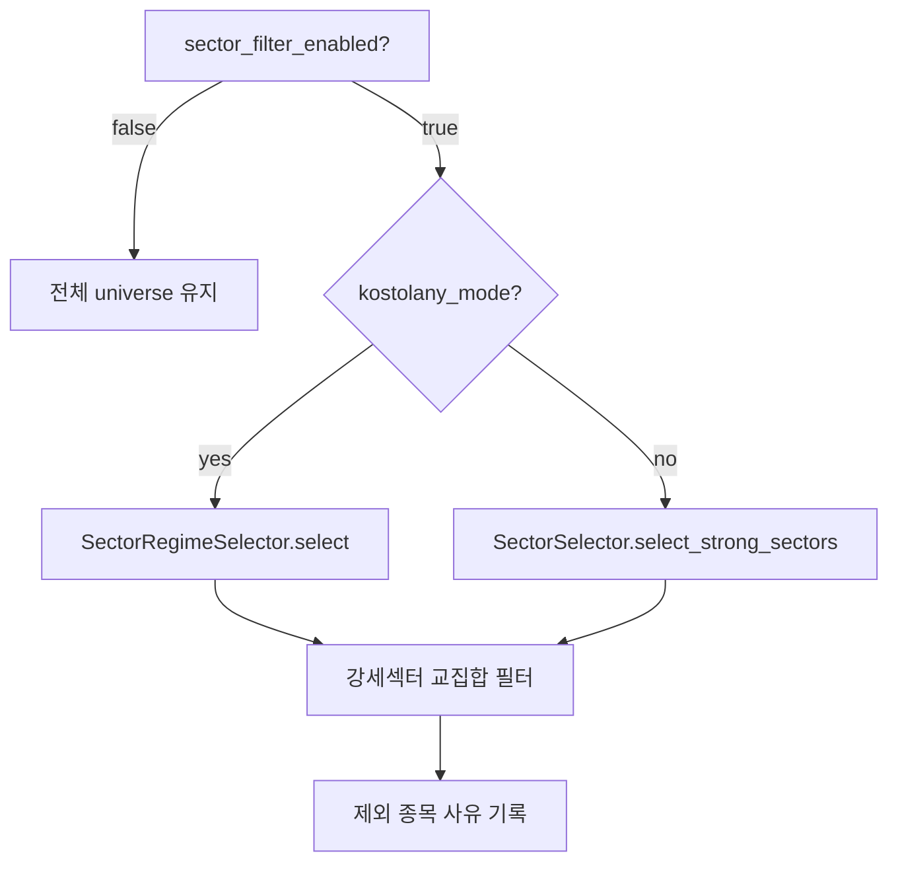

---

### 2.4 종목 후보 선정 및 점수화 프로세스

#### 1. 개요
- **목적**: 거래가능 유니버스 생성 → 전략별 final_score 산출 → `candidate_snapshot` 저장.
- **시작 조건**: `candidate_generation` 잡(16:20) 또는 API.
- **실행 방식**: scheduler / manual.

#### 2. 처리 흐름
1. `generate_candidates(ref_date)` (`scheduler.py:216`)
2. 직전 `collect_daily` 결과 재사용 또는 재수집
3. `_to_securities()`로 `Security` 변환
4. `DataQualityFilter(mode="live").generate(ref_date, candidates)` → 유니버스 (`universe_filter.py:76`)
5. `_analyze_regime()` → `weekly_pass`, `regime_label`
6. (옵션) 섹터 필터
7. `_RUNNABLE_STRATEGIES` 순회 — `preferred_regimes` 불일치/`entry_policy` 불허 전략 스킵(단 `weekly_trend_fail`은 스냅샷 저장)
8. `_save_candidate_snapshot()` — ticker별 점수·가격계획·AI 결과 저장 (`scheduler.py:1072`)

#### 3. 관련 코드
| 구분 | 파일 | 클래스/함수 |
|---|---|---|
| Entry | `ops/scheduler.py` | `generate_candidates` |
| Universe | `data_quality/universe_filter.py` | `DataQualityFilter.generate`, `_check_as_of` |
| TrendStrength | `indicator/trend_strength.py` | `TrendStrengthCalculator.score_one` |
| Score | `strategy/scoring.py` | `LegacyFinalScoreCalculator`, `StrategyAwareScoreCalculator` |
| Valuation | `ai/valuation_margin.py` | `ValuationMarginScorer` (rule-based) |
| DB | `common/models.py` | `candidate_snapshot`, `universe_quality_log` |

#### 4. 입력 데이터
- `CollectionResult.meta/ohlcv`, `historical_ohlcv`(via `HistoricalOHLCVRepository.to_dataframe`), `security_metadata.sector`, `RegimeResult`, 설정 가중치.

#### 5. 출력 데이터
- `candidate_snapshot` 행(전략별), `universe_quality_log` 행, 잡 details(kept/rejected/rejection_ratio 등).

#### 6. 데이터 저장 및 DB
- 테이블 `candidate_snapshot`: 전략+ref_date로 기존 행 `delete` 후 재삽입 (`scheduler.py:1082-1087`).
- 주요 컬럼: factor_score, trend_strength, ts_bucket, final_score, score_type, strategy_type, component_scores, score_reason, excluded_reason, weekly_pass, ai_technical_score, ai_buy/stop/target_price, ai_analysis_memo, valuation_margin_*, ai_contrarian_*, holding_type, technical/thesis/emergency_stop, trading/value_target, first/final_sell_price.
- `universe_quality_log`: 거부율 등 (`DataQualityFilter._log`).

#### 7. 외부 연계
- AI(§2.5/2.6) 호출은 후보 top-N 한정. 그 외 외부 연계 없음(DB·계산).

#### 8. 의사결정 로직 (코드 임계값)
- 유니버스 필터(`_check_as_of`, live 모드): 메타 결측, 가격 결측, OHLCV 필드 결측, 과도한 결측 이력 → 제외. `MIN_LISTING_DAYS=100`, `MIN_TURNOVER_KRW`(KOSPI 5e8/KOSDAQ 3e8), `EXCLUDED_TYPES={SPAC}`, 거부율 ≥40% 알림.
- `factor_score = turnover/max_turnover×100` (거래대금 정규화).
- Legacy final_score = `0.6×factor + 0.4×trend_strength` (+AI weight 오버레이).
- StrategyAware(설정 활성 시): 전략유형별 가중치(`_BREAKOUT/_PULLBACK/_CONTRARIAN/_MULTI_ASSET_WEIGHTS`). CONTRARIAN_QUALITY는 valuation<60이면 score≤39로 캡 + excluded_reason.
- AI 대상 선정: rule-based 사전점수 상위 `maps_ai_candidate_top_n`(기본5)만 Bedrock 호출.

#### 9. 예외 처리
| 예외 | 위치 | 처리 |
|---|---|---|
| OHLCV 없음/TS 계산 실패 | `_save_candidate_snapshot` | trend_strength=50, ts_bucket="S3" 중립값 |
| AI score 예외 | 동 | `except` 후 None(기존 점수 유지) |
| 잡 전체 실패 | `_job` | rollback + `send_job_failed` Slack |

#### 10. 운영 확인 포인트
- `candidate_snapshot` 테이블, `universe_quality_log`, API `GET /candidates/{date}`.

#### 11. Mermaid
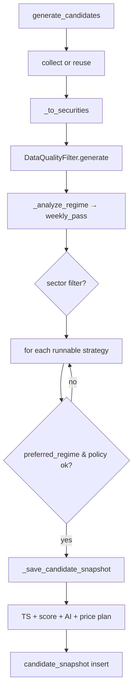

---

### 2.5 AI 기술적 분석 프로세스

#### 1. 개요
- **목적**: Bedrock Claude로 기술적 점수(0~100)·매수가/손절가/목표가 산출.
- **시작 조건**: `_save_candidate_snapshot` 내부, `MAPS_AI_TECHNICAL_SCORING_ENABLED=true` + 후보가 top-N에 포함될 때.
- **실행 방식**: scheduler(후보 생성 시점 16:20, 주문과 분리).

#### 2. 처리 흐름
1. `AITechnicalScorer.from_settings()` 생성 (`technical_scorer.py:85`)
2. `score(ticker, name, ohlcv_df, strategy_id, ts_score, ts_bucket, ref_date)` (`:97`)
3. 자격증명/데이터(30행 미만) 검증 → 미충족 시 None
4. `_calc_indicators`(MA/RSI/MACD/ATR/거래량비/52주) → `_build_prompt` → `_call_bedrock`(boto3 invoke_model) → `_parse_response`
5. 결과 가격 이상값 보정(매수가 현재가±8%, 손절<현재가, 목표>현재가)

#### 3. 관련 코드
| 구분 | 파일 | 클래스 | 함수 |
|---|---|---|---|
| AI | `ai/technical_scorer.py` | `AITechnicalScorer` | `score`, `_calc_indicators`, `_call_bedrock`, `_parse_response` |
| 결과 | `ai/technical_scorer.py` | `AIScore` | — |

#### 4. 입력 데이터
- OHLCV DataFrame(≥30행), strategy_id, ts_score/bucket. 설정: `aws_access_key_id/secret`, `aws_region`, `aws_bedrock_model_id`(기본 `us.anthropic.claude-sonnet-4-6`).

#### 5. 출력 데이터
- `AIScore`(technical_score, pattern, support/resistance, ai_buy/stop/target_price, risk_factors, reasoning, raw_memo) 또는 None.

#### 6. DB
- 직접 저장 안 함. 호출부(`_save_candidate_snapshot`)가 `candidate_snapshot.ai_*` 컬럼에 기록.

#### 7. 외부 연계
| 외부 | 호출 파일/함수 | 요청 | 응답 | 실패 처리 |
|---|---|---|---|---|
| AWS Bedrock(Claude) | `technical_scorer._call_bedrock` (boto3) | max_tokens=512, temp=0.1, 프롬프트(지표+30일 OHLCV) | JSON 텍스트 | 예외/파싱실패 → None(기존 점수 유지) |

#### 8. 의사결정
- technical_score는 final_score에 `ai_weight`(기본0.20)로 가중. 가격 3종은 AI 우선, None이면 rule-based 폴백.

#### 9. 예외 처리
| 예외 | 처리 | 로그 |
|---|---|---|
| 자격증명 미설정 | None | debug |
| 데이터<30행/빈 | None | debug |
| API/파싱 오류 | None | warning |

#### 10. 운영 확인 포인트
- `candidate_snapshot.ai_technical_score`, `ai_analysis_memo`. 로그 "[AITechnicalScorer] … 분석 실패".

#### 11. Mermaid
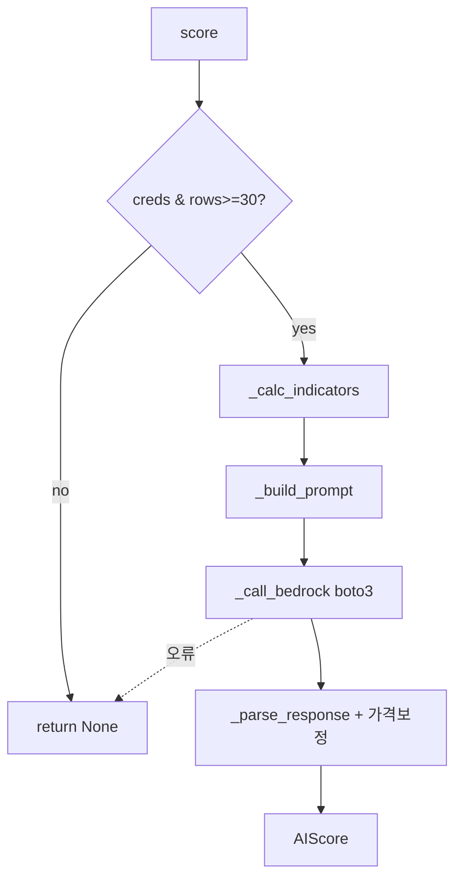

---

### 2.6 AI 역발상 검증 프로세스

#### 1. 개요
- **목적**: 코스톨라니식 역발상 관점으로 rule-based 후보를 검증(매수신호 생성 아님).
- **시작 조건**: `MAPS_AI_CONTRARIAN_CHECK_ENABLED=true` **그리고** `MAPS_AI_ANALYSIS_MODE=="all"` (technical_only면 스킵).

#### 2. 처리 흐름
1. `AIContrarianAnalyzer.from_settings()` (조건 충족 시)
2. top-N 후보에 대해 `analyze(...)` 호출 (`scheduler.py:1336`)
3. `final_opinion`: REJECT → final_score −20, WATCH → −5 (`scheduler.py:1348-1352`)

#### 3. 관련 코드
| 구분 | 파일 | 클래스 | 함수 |
|---|---|---|---|
| AI | `ai/contrarian_analyzer.py` | `AIContrarianAnalyzer` | `analyze` |
| 결과 | `ai/contrarian_analyzer.py` | `ContrarianAnalysisResult` | — |

#### 4~5. 입력/출력
- 입력: ticker/name/close/52주하락률/유동성·추세·밸류점수/섹터. 출력: `ContrarianAnalysisResult`(contrarian_score, crowd/expectation_risk, …, final_opinion PASS/WATCH/REJECT, thesis/anti_thesis).

#### 6. DB
- 호출부가 `candidate_snapshot.ai_contrarian_*` 컬럼에 저장.

#### 7. 외부 연계
| 외부 | 실패 처리 |
|---|---|
| AWS Bedrock(Claude) | 예외 시 warning 후 rule-based fallback / 점수 유지 |

#### 8. 의사결정
- REJECT/WATCH에 따른 final_score 감산. (보유성격 분류에도 opinion 반영)

#### 9~10. 예외/운영
- 로그 "AI 역발상 검증 오류 […]". `candidate_snapshot.ai_contrarian_opinion`.

#### 11. Mermaid
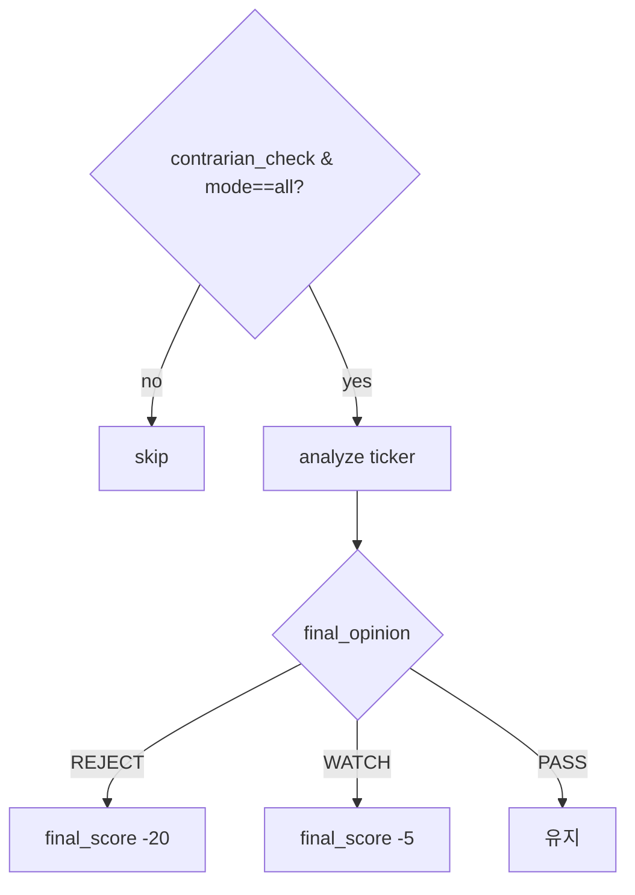

---

### 2.7 가치/목표가/손절가/보유성격 산출 프로세스 (rule-based)

#### 1. 개요
- **목적**: AI와 별개로 rule-based 안전마진·이중 목표가/손절가·보유성격(CORE/SWING/TRADING/WATCH/BAN) 산출.

#### 2. 처리 흐름 (`_save_candidate_snapshot` 내)
1. `ValuationMarginScorer.score()` (활성 시, `maps_valuation_margin_enabled` 기본 true)
2. rule-based 가격계획: `plan_buy = round_up_krx_price(close×(1+slippage))`, `plan_stop = min(stop_loss_price, atr_stop_price)`, `plan_target = plan_buy + (plan_buy-plan_stop)×rr`
3. `HoldingTypeClassifier.classify()` (활성 시)
4. `KostolanyPriceCalculator.calculate()` (기본 활성) → technical/thesis/emergency_stop, trading/value_target, first/final_sell_price

#### 3. 관련 코드
| 구분 | 파일 | 클래스/함수 |
|---|---|---|
| 안전마진 | `ai/valuation_margin.py` | `ValuationMarginScorer.score` |
| 손절율 | `strategy/live_rules.py` | `stop_loss_price`, `atr_stop_price` |
| 가격계획 | `strategy/price_calculator.py` | `KostolanyPriceCalculator.calculate` |
| 보유성격 | `strategy/holding_type.py` | `HoldingTypeClassifier.classify` |
| 펀더멘털 | `data/fundamental_repo.py` | `FundamentalValuationProvider` |

#### 4~5. 입력/출력
- 입력: ohlcv_df, atr14, 52주 고저, 펀더멘털(PER/PBR/EPS/BPS/historical avg), `maps_trade_rr_ratio`(2.0), `maps_order_slippage_pct`(0.01).
- 출력: `candidate_snapshot`의 가격/보유 컬럼.

#### 6. DB
- `candidate_snapshot` 가격 컬럼군(b7c9a1d4 마이그레이션 + a3f7c2d8 kostolany 컬럼).

#### 8. 의사결정 (코드)
- `stop_loss_price`: 전략별 손절율(pullback_v3 5%, ath_breakout_v1 10% 등, `live_rules.py`).
- target = buy + 손절폭 × rr(2.0).

#### 9~10. 예외/운영
- 각 산출 try/except로 감싸 오류 시 None. `MAPS_KOSTOLANY_PRICE_CALCULATOR_ENABLED` 기본 true.

#### 11. Mermaid
```mermaid
flowchart TD
    A[current_close>0] --> B[plan_buy=round_up(close*(1+slip))]
    B --> C[plan_stop=min(stop_loss, atr_stop)]
    C --> D[plan_target=buy+(buy-stop)*rr]
    A --> E[ValuationMarginScorer]
    A --> F[HoldingTypeClassifier]
    A --> G[KostolanyPriceCalculator]
    G --> H[technical/thesis/emergency stop, trading/value target]
```

---

### 2.8 검증 및 전략 승격 프로세스

#### 1. 개요
- **목적**: WFA/Plateau/MC 생성 후 `PromotionGate`로 단계 승격 평가.
- **시작 조건**: `validation` 잡(16:40).

#### 2. 처리 흐름
1. `run_validation(ref_date)` → `_generate_validation_metrics` + `_evaluate_promotions` (`scheduler.py:386`)
2. 후보 전략별 OHLCV 히스토리 충분 시 백테스트 그리드 → Plateau/MC/WFA 저장
3. `_evaluate_promotions`: 최신 plateau/mc/wfa/promotion 행 조회 → `_promotion_metrics`로 robustness/risk/recovery/return/mc_mdd_p95 산출 → `PromotionGate.evaluate()`

#### 3. 관련 코드
| 구분 | 파일 | 클래스/함수 |
|---|---|---|
| Entry | `ops/scheduler.py` | `run_validation`, `_generate_validation_metrics`, `_evaluate_promotions` |
| WFA | `validation/walk_forward.py` | `WalkForwardAnalyzer.run` |
| Plateau | `validation/plateau.py` | `ParameterPlateauTester.run` |
| MC | `validation/monte_carlo.py` | `MonteCarloValidator.validate` |
| Gate | `promotion/gate.py` | `PromotionGate.evaluate` |
| Backtest | `backtest/engine.py` | `BacktestEngine.run` |

#### 4~5. 입력/출력
- 입력: `candidate_snapshot` 전략 목록, `historical_ohlcv`(min_bars=`(36+5×12)×21`), `STRATEGY_GROUP_MAP`, `WEIGHT_PRESETS["balanced"]`.
- 출력: `parameter_plateau_results`, `monte_carlo_sequence_results`, `walk_forward_results`+`walk_forward_fold_results`, `promotion_history`.

#### 6. DB
- 위 5개 테이블 append + commit. `_latest_promotion_rows`는 `passed=True`만 읽어 강등 방지.

#### 8. 의사결정 (코드)
- WFA pass: sharpe_mean>0 AND negative_folds≤1 AND mean_g2p≥0.6 (CLAUDE.md 근거).
- Gate 임계값: RESEARCH/ALERT_ONLY→60(MOCK_CANDIDATE), MOCK_CANDIDATE/LIVE_CANDIDATE→75. 즉시실패 가드(is_cagr≤0, mock_sharpe≤0), MC 한도(`ALLOWED_MDD[group]`), Live Small(Mock 3개월/리플레이 63일).
- 승격 실패=현재 단계 유지(REJECTED 강등 아님).

#### 9. 예외 처리
| 예외 | 위치 | 처리 |
|---|---|---|
| 히스토리 부족 | `_generate_validation_metrics` | skipped 기록 |
| Plateau/MC ValueError | `_save_*` | warning 후 False |
| Unknown strategy(MC단계) | `PromotionGate` | `UnknownStrategyError` |
| 점수계산 오류 | `evaluate` | passed=False, REJECTED |

#### 10. 운영 확인 포인트
- `promotion_history`, `walk_forward_results`, API `GET /wfa/results/{id}`, 로그 "PromotionGate […]".

#### 11. Mermaid
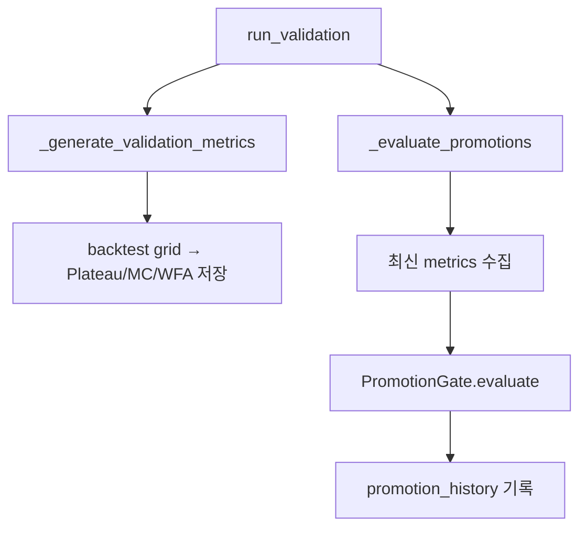

---

### 2.9 매수 조건 판단 및 주문 프로세스

#### 1. 개요
- **목적**: 후보를 진입 정책·신호·갭·신선도·Kill Switch 체크 후 매수 주문.
- **시작 조건**: `order_cycle` 잡(08:55), `MAPS_LIVE_TRADING_ENABLED=true` AND `MAPS_DRY_RUN=false`.

#### 2. 처리 흐름 (`run_order_cycle` → `_submit_candidate_orders`)
1. `get_broker(maps_broker_mode)` + `OrderManager` 생성, `sync_broker_state`, 포트폴리오 스냅샷 (`scheduler.py:433-441`)
2. live & not dry_run → `_submit_exit_orders` 먼저(매도), 그다음 `_is_data_fresh` 통과 시 `_submit_candidate_orders`
3. `_order_candidates`: 최신 ref_date, weekly_pass, final_score≥min_score, 승격단계∈{live_candidate, live}, claimed 제외, ticker당 최고점수 1개
4. 후보별: 진입정책 allowed, 진입 한도(`max_orders=round(3×ratio)`), 보유중 제외, 전략 entry_signal 확인, 갭 체크, 지정가 산정, 수량 계산 → `manager.submit(order, daily_pnl)`

#### 3. 관련 코드
| 구분 | 파일 | 클래스/함수 |
|---|---|---|
| Entry | `ops/scheduler.py` | `run_order_cycle`, `_submit_candidate_orders`, `_order_candidates`, `_order_qty` |
| Order | `execution/order_manager.py` | `OrderManager.submit`, `_place_with_retry` |
| Risk | `risk/manager.py` | `RiskManager.check_before_order` |
| Broker | `execution/broker_adapter.py` | `get_broker`, `place_order` |
| Signal | `ops/scheduler.py` | `_latest_strategy_signal` (전략 `generate_signals`) |

#### 4. 입력 데이터
- `candidate_snapshot`(주문후보), 브로커 잔고/포지션, `historical_ohlcv`(신호·종가), 설정(slippage, max_gap, min_score, max_single_exposure).

#### 5. 출력 데이터
- 브로커 주문(BUY LIMIT), `order_log` 행, `portfolio_snapshot` 갱신, 잡 details(submitted/skipped).

#### 6. DB
- `order_log`(append, 중복가드), `portfolio_snapshot`(broker source upsert), `collection_log`(scheduler.orders).

#### 7. 외부 연계
| 외부 | 호출 | 실패 처리 |
|---|---|---|
| 브로커(mock/KIS/Kiwoom) | `OrderManager.submit→broker.place_order` | 재시도(transient), 거부→on_order_failure, 후보 스킵 |

#### 8. 의사결정 (코드 임계값)
- 주문 자격 단계: `eligible_stages={live_candidate, live}` (`_order_candidates`).
- `max_orders = max(1, round(3 × max_policy_ratio))`.
- 갭: `gap_pct > maps_order_max_gap_pct(0.02)` → 스킵.
- 지정가: ai_buy_price가 현재가×1.05 이내면 사용, 아니면 `round_up_krx_price(close×(1+slippage))`.
- 수량: `min(total×max_single_exposure(0.10), remaining_cash/slots)//price`.
- CONTRARIAN_QUALITY + valuation<60 → 후보 제외.

#### 9. 예외 처리
| 예외 | 위치 | 처리 |
|---|---|---|
| `KillSwitchError` | submit | 당일 매수 중단(break) |
| `DuplicateOrderError` | submit | 스킵 |
| `BrokerAdapterError` | submit | 해당 후보 스킵(잡 유지) |
| stale data | `_is_data_fresh` | 매수 전량 스킵 |

#### 10. 운영 확인 포인트 — **실제 주문 / Dry-run 구분**
- `order_log.mode`("live"/"mock"), `order_log.broker`.
- live 주문 진입 조건: `MAPS_LIVE_TRADING_ENABLED=true` AND `MAPS_DRY_RUN=false`. dry_run이면 "[DRY-RUN]" 로그만(`_log_dry_run_candidates`).
- 비활성 시 note "Order submission disabled by MAPS_LIVE_TRADING_ENABLED=false".

#### 11. Mermaid (시퀀스)
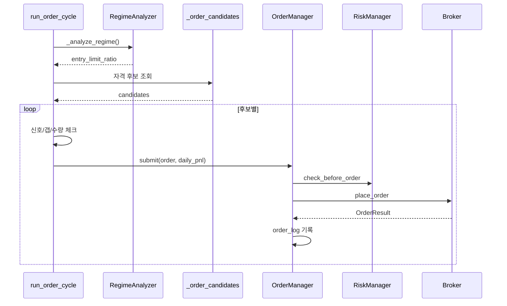

---

### 2.10 매도(익절/손절/전략청산) 판단 및 주문 프로세스

#### 1. 개요
- **목적**: 보유 포지션에 대해 손절 또는 전략 청산 신호 시 시장가 매도.
- **시작 조건**: `run_order_cycle`(08:55) 및 장중 `broker_sync`(장 개장 중) — `_submit_exit_orders`.

#### 2. 처리 흐름 (`_submit_exit_orders`, `scheduler.py:1697`)
1. 브로커 포지션 상세 조회
2. `order_log`에서 종목별 진입(BUY filled/partially_filled) 매핑, 없으면 expired 주문 폴백
3. 종목별: `_latest_strategy_signal`, 현재가, `stop_price=atr_stop_price or stop_loss_price`
4. `stop_triggered(current≤stop)` 또는 `strategy_exit(signal.exit_signal)` → SELL MARKET `manager.submit_exit(order)`

#### 3. 관련 코드
| 구분 | 파일 | 함수 |
|---|---|---|
| Exit | `ops/scheduler.py` | `_submit_exit_orders` |
| Order | `execution/order_manager.py` | `submit_exit`(리스크 체크 없이) |
| Stop | `strategy/live_rules.py` | `stop_loss_price`, `atr_stop_price` |

#### 4~5. 입력/출력
- 입력: 브로커 포지션, `order_log` 진입가, 현재가(장중 갱신가 또는 종가), atr14.
- 출력: SELL 주문, `order_log` 행, exit_tickers.

#### 6. DB
- `order_log`(SELL). 진입가 복원에 `order_log`(filled/expired) 사용.

#### 8. 의사결정
- `stop_triggered = stop_price is not None AND current>0 AND current≤stop_price`.
- reason = "stop_loss" 우선, 아니면 "strategy_exit".
- 장중 `broker_sync`는 `update_prices`로 pykrx 현재가 갱신 후 손절 판정(`sync_broker_state`, `_fetch_intraday_prices`).

#### 9. 예외 처리
| 예외 | 처리 |
|---|---|
| 진입기록 없음 | 스킵 (expired 폴백 시도) |
| `DuplicateOrderError` | 스킵 + exit_tickers 추가 |
| `BrokerAdapterError` | 청산 스킵(잡 유지) |

#### 10. 운영 확인 포인트
- `order_log` side=sell, memo("stop_loss/strategy_exit entry=… current=… stop=…"). 로그 "Exit submitted […]".

#### 11. Mermaid
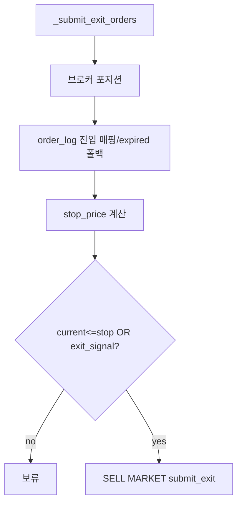

---

### 2.11 체결 결과 동기화 프로세스

#### 1. 개요
- **목적**: 브로커 체결/미결주문/포지션을 `order_log`·`portfolio_snapshot`에 반영.
- **시작 조건**: `broker_sync`(60초), `order_cycle`·`eod_cleanup` 내부 호출.

#### 2. 처리 흐름 (`OrderManager.sync_broker_state`, `order_manager.py:134`)
1. 잔고 조회, `get_open_orders`, `get_daily_order_results`
2. 브로커 결과로 `order_log` 상태/체결가/수량 갱신; MAPS 외부 주문은 `external_mts`로 삽입
3. `_reconcile_same_day_buys`(당일 매수 보정), 포지션 기반 매도 체결 폴백(포지션에서 사라진 pending SELL→filled)
4. `expire_pending_orders(before=KST자정)` — 포지션 대조 후 미해결 전일분 만료

#### 3. 관련 코드
| 구분 | 파일 | 함수 |
|---|---|---|
| Sync | `execution/order_manager.py` | `sync_broker_state`, `_reconcile_same_day_buys`, `expire_pending_orders` |
| Snapshot | `ops/scheduler.py` | `_save_portfolio_snapshot` |

#### 4~5. 입력/출력
- 입력: 브로커 `AccountBalance`/`OrderResult`/positions. 출력: `order_log` 갱신, `portfolio_snapshot`, sync dict(cash/positions_value/open_orders/updated/expired/sync_errors).

#### 6. DB
- `order_log`(update/insert), `portfolio_snapshot`(broker source upsert, holdings 포함).

#### 7. 외부 연계
| 외부 | 호출 | 실패 처리 |
|---|---|---|
| 브로커 | `get_account_balance/get_open_orders/get_daily_order_results/get_positions` | `BrokerAdapterError`→sync_errors 증가, 빈값 |

#### 8. 의사결정
- 포지션 기반 매도 폴백: KIS VTS가 daily CCLD에 장전 시장가 매도를 누락하는 케이스 보정.

#### 9~10. 예외/운영
- 로그 "Broker … sync unavailable", "Position-based fill: …". `order_log.status`, `portfolio_snapshot`.

#### 11. Mermaid
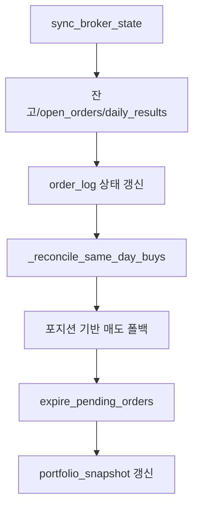

---

### 2.12 EOD 정리 프로세스

#### 1. 개요
- **목적**: 장 마감 후 미체결 주문 취소·브로커 EOD·체결 동기화·만료.
- **시작 조건**: `eod_cleanup` 잡(15:35).

#### 2. 처리 흐름 (`run_eod_cleanup`, `scheduler.py:596`)
1. `get_open_orders` → 각 `cancel_order`
2. `broker.eod_cleanup()`(존재 시)
3. `sync_broker_state()` (만료 전 마지막 동기화)
4. `expire_pending_orders(before=now)`

#### 3~6. 코드/입출력/DB
- `OrderManager.expire_pending_orders`, `collection_log`(scheduler.eod), `order_log`.

#### 9~10. 예외/운영
- 잡 details(open_orders_seen/cancelled/expired). `collection_log`.

#### 11. Mermaid
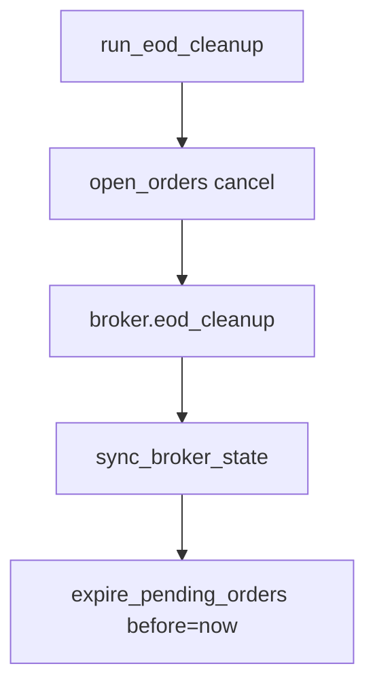

---

### 2.13 매매 리뷰/복기 및 정산 진단 프로세스

#### 1. 개요
- **목적**: 매수/매도 손익·승률·전략별 통계(리뷰), 미체결 도달가능성(정산) 분석.
- **시작 조건**: API `GET /api/v1/trade-review`(리뷰), `build_reconciliation`(정산, 호출처는 라우터/리포트 — **확인 필요**).
- **실행 방식**: manual(화면).

#### 2. 처리 흐름
- 리뷰(`api/trade_review.py:get_trade_review`): `order_log` 매수(filled/partially_filled)·매도 + `portfolio_snapshot`(초기/현재자산·holdings) → 포지션별 손익/보유일/상태(open/closed/estimated_exit) 산출 → 요약·전략별 통계.
- 정산(`ops/reconciliation.py:build_reconciliation`): 최근 N일 `order_log` 상태 집계(체결률) + 미체결(expired/pending/partial) 종목의 당일 OHLCV로 `reachable` 판정.

#### 3. 관련 코드
| 구분 | 파일 | 함수 |
|---|---|---|
| 리뷰 | `api/trade_review.py` | `get_trade_review`, `_close_on_or_before` |
| 정산 | `ops/reconciliation.py` | `build_reconciliation`, `_reachable`, `format_reconciliation_text` |
| 리포트 | `ops/report_generator.py` | (상세 **확인 필요**) |

#### 4~5. 입력/출력
- 입력: `order_log`, `portfolio_snapshot`, `historical_ohlcv`, `security_metadata`.
- 출력: `TradeReviewResponse`(summary/trades/by_strategy), `ReconciliationSummary`(by_side/unfilled).

#### 6. DB
- 읽기 전용(저장 없음).

#### 8. 의사결정 (실패 원인 분류 — 정산)
- 미체결 `reachable`: 매수=low≤지정가, 매도=high≥지정가. 데이터/지정가 없으면 None(판정불가). "도달가능인데 미체결"이면 별도 원인 의심.
- 리뷰 상태: 보유중=open, 체결매도=closed, 매도 체결가 미기록=estimated_exit(매도일 종가 추정).

#### 9~10. 예외/운영
- 매도 기록 없이 포지션 소멸 시 note "매도 기록 없음". 화면 `/trade-review`.

#### 11. Mermaid
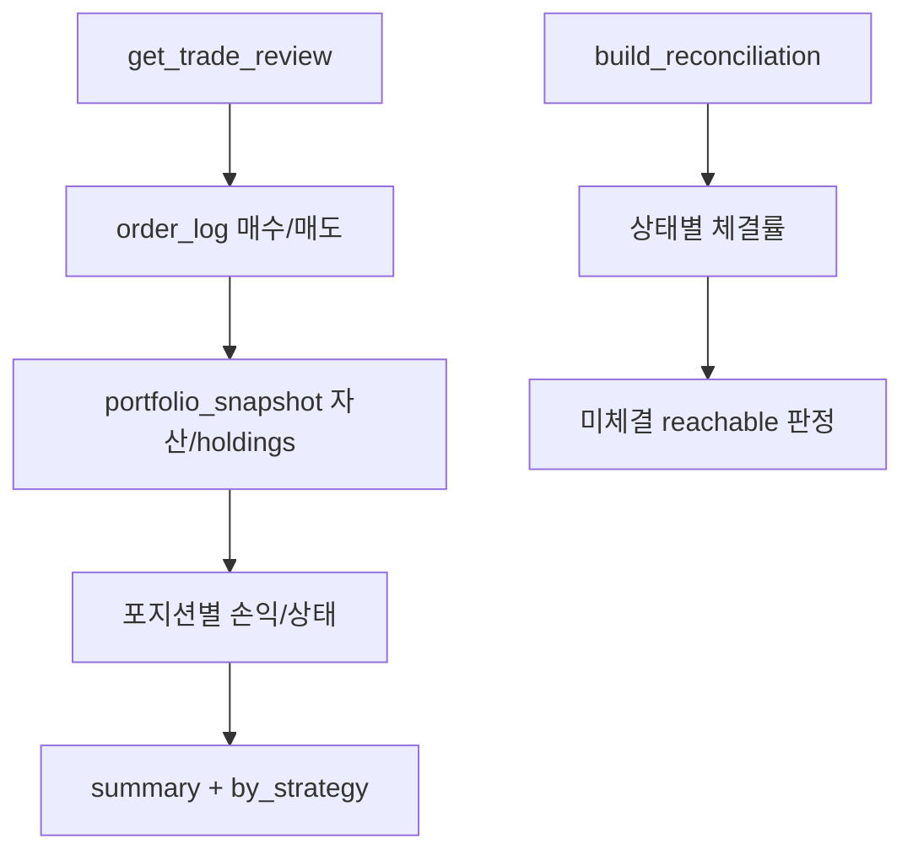

---

### 2.14 리스크 관리 / Kill Switch / 알림 프로세스

#### 1. 개요
- **목적**: 주문 전 리스크 차단, 연속 실패·손실·MDD 시 Kill Switch, Slack 알림.
- **시작 조건**: 매 주문(`check_before_order`), 주문 실패(`on_order_failure`), API(`/risk/kill-switch/*`).

#### 2. 처리 흐름
- 주문 전: `RiskManager.check_before_order` — Kill Switch 활성? → 일일손실≤−1.5%? → 단일종목 노출>10%? → (활성 시)섹터/테마 노출.
- 실패 누적: `on_order_failure` 5회 → `_trigger_kill`(CONSECUTIVE_FAILURE).
- Kill Switch: 신규진입 자동 차단, 청산은 `approve_liquidation`(사용자 승인 필수).

#### 3. 관련 코드
| 구분 | 파일 | 함수 |
|---|---|---|
| Risk | `risk/manager.py` | `check_before_order`, `on_order_failure`, `_trigger_kill`, `is_new_entry_blocked`, `approve_liquidation`, `release` |
| Alert | `ops/notifications.py` | `SlackNotifier.send_kill_switch`, `send_job_failed`, `send_order_alert` |

#### 4~5. 입력/출력
- 입력: Order, AccountBalance, daily_pnl, `RiskConfig`. 출력: 예외(KillSwitchError/ExposureCapError), `kill_switch_log` 행, Slack 메시지.

#### 6. DB
- `kill_switch_log`: event_type∈{trigger, approved, deactivate}, reason, value(detail), new_entry_blocked, approved_by.

#### 7. 외부 연계
| 외부 | 호출 | 실패 처리 |
|---|---|---|
| Slack Webhook | `SlackNotifier` | `slack_webhook_url` 비면 no-op |

#### 8. 의사결정 (코드 임계값)
- `daily_loss_limit=0.015`, `mdd_limit=0.15`, `position_size_limit/max_single_exposure=0.10`, `_CONSEC_FAILURE_THRESHOLD=5`.
- 섹터/테마 한도(`maps_*_exposure_limit_enabled` 활성 시) 25%/35%.

#### 9~10. 예외/운영
- `kill_switch_log`, 로그 "Kill Switch 발동 […]". API `/risk/kill-switch/trigger|release|approve-liquidation`.

#### 11. Mermaid
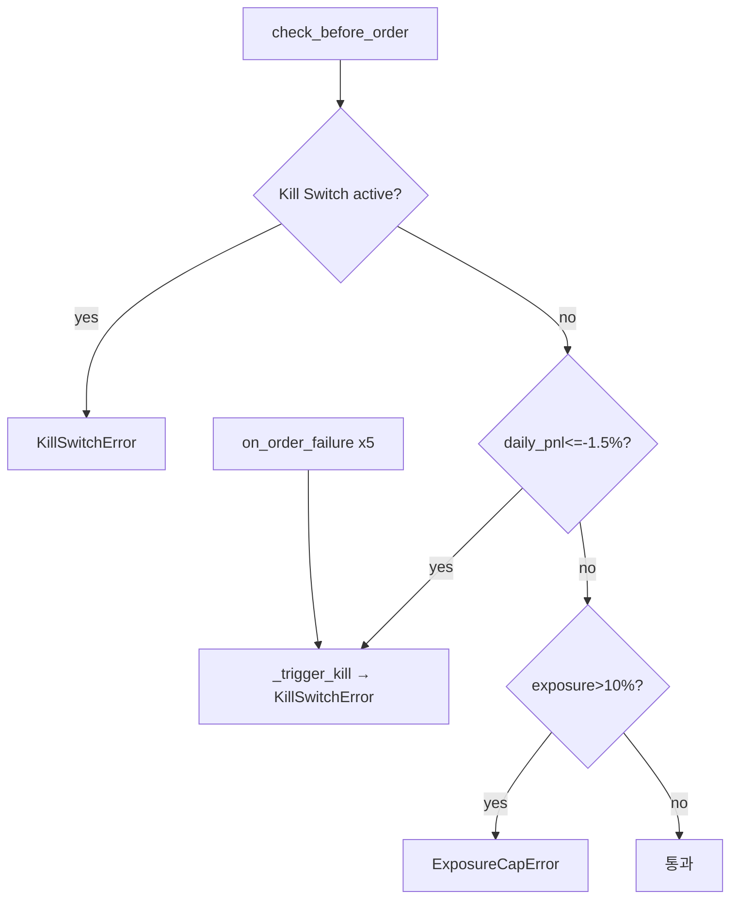

---

## 3. 데이터 처리 구조

| 항목 | 코드 확인 내용 |
|---|---|
| pandas DataFrame | 사용. OHLCV·지표·신호 전반(`collector.py`, `technical_scorer.py`, `regime.py`, `_latest_strategy_signal` 등) |
| CSV/Excel | 미확인(코드 경로 없음). stock_report는 **HTML** 결과 저장(`stock_report_runs`) |
| JSON | 설정/응답 파싱, `component_scores` 등 JSON 컬럼, AI 응답 파싱 |
| DB | 기본 SQLite `sqlite:///./maps.db`(`maps_db_url`), `MAPS_DB_URL`로 PostgreSQL 전환(psycopg2) |
| ORM | SQLAlchemy 2.0, `Base.metadata.create_all()`(`main.py:71`) + Alembic |
| Repository 패턴 | `HistoricalOHLCVRepository`, `SecurityRepository`, `FundamentalValuationProvider` |
| 데이터 저장 위치 | `maps.db`(SQLite) 또는 외부 PostgreSQL; 로그 `logs/`(`maps_log_dir`) |
| 상태값 관리 | `order_log.status`(pending/filled/partially_filled/expired/rejected/cancelled), `promotion_history.to_stage`, `kill_switch_log.event_type` |

### 확인된 테이블 (18, `common/models.py`)
`security_metadata, universe_quality_log, candidate_snapshot, historical_ohlcv, security_fundamental, collection_log, portfolio_snapshot, parameter_plateau_results, walk_forward_results, walk_forward_fold_results, monte_carlo_sequence_results, promotion_history, tradeability_weight_log, order_log, stock_report_runs, kill_switch_log, strategy_param_log, cost_model_assumptions`

> 컬럼 전체·인덱스·FK 상세는 본 분석 범위에서 부분 확인 → **확인 필요**.

---

## 4. 외부 연계 구조

| 외부 시스템 | 호출 파일 / 함수 | 요청 데이터 | 응답 데이터 | 실패 시 처리 |
|---|---|---|---|---|
| KRX (pykrx) | `data/krx_adapter.py KRXAdapter`, `market/regime.py`, `scheduler._fetch_intraday_prices`, `stock_analysis/analyzer.py` | ref_date, ticker, 지수코드 | OHLCV/메타/지수 주봉/현재가 | 경고 후 빈값/폴백 |
| 해외지수 (yfinance) | `market/regime.py _from_yfinance` | ^GSPC/^IXIC/KRW=X/GC=F/CL=F/HG=F | 일봉→주봉 | 경고 후 빈 리스트 |
| 한국투자증권 (KIS) | `execution/kis_adapter.py KISAdapter` | OAuth token, hashkey, order-cash, cancel, balance, daily-ccld (`_TR_IDS` paper/real) | OrderResult/Position/Balance | `BrokerAdapterError`, 재시도/스킵 |
| 키움증권 | `execution/kiwoom_adapter.py KiwoomAdapter` | (상세 **확인 필요**) | — | — |
| AWS Bedrock (Claude) | `ai/technical_scorer.py`, `ai/contrarian_analyzer.py` (boto3 invoke_model) | 프롬프트(지표/OHLCV) | JSON 텍스트 | None/fallback |
| DART | `stock_analysis/analyzer.py` (requests) | 재무제표 요청 | 재무 XML/JSON | (상세 **확인 필요**) |
| 뉴스 API | — | — | — | **미확인(없음)** |
| Slack | `ops/notifications.py SlackNotifier` | Webhook payload | — | webhook 미설정 시 no-op |
| Email/Telegram | — | — | — | **미확인(없음)** |

브로커 선택: `get_broker(maps_broker_mode)` — `mock`/`kis`/`kiwoom`. KIS base URL은 `kis_real_base_url`/`kis_paper_base_url`, TR-ID는 `kis_real_trading`으로 paper/real 분기.

---

## 5. 자동 실행 구조

| 항목 | 코드 확인 내용 |
|---|---|
| 스케줄러 | APScheduler `BackgroundScheduler`(`MapsOperationalScheduler`) |
| 트리거 | weekday 잡 `CronTrigger(day_of_week=mon-fri)`, `broker_sync` `IntervalTrigger(60s)`, `stock_report` `CronTrigger`(매일) |
| 활성화 | `MAPS_SCHEDULER_ENABLED=true`(기본 false), `_lifespan`에서 시작 |
| cron/Task Scheduler/배치 | OS 레벨 cron·Windows Task·shell/batch 스크립트 **미확인**(앱 내 APScheduler만) |
| 비동기 | FastAPI async 라우트, 스케줄러는 동기 잡(BackgroundScheduler 스레드) |
| 반복 루프 | `broker_sync` 60초 interval |
| 장중 실행 조건 | `sync_broker_state`에서 `broker.is_market_open()` true일 때 `_submit_exit_orders` 활성 |
| 장마감 실행 | `eod_cleanup`(15:35) |
| 거래일 가드 | `_make_krx_job` → `_is_krx_market_day()`(주말+`holidays.KR`+`MAPS_KRX_CLOSED_DATES`) |

`run_once(job_name)`/`backfill_*`로 수동 실행. API `POST /scheduler/run/{job_name}`, `GET /scheduler/status`.

---

## 6. 예외 처리 구조

| 패턴 | 코드 확인 |
|---|---|
| try/except | 전 모듈. 잡 단위 `OperationalPipeline._job`이 예외 시 rollback + `send_job_failed` |
| logging | `common/logging_config.py configure_logging()`, `logs/maps.log`(RotatingFile, `maps_log_*`) |
| retry | `OrderManager._place_with_retry`(`maps_order_retry_attempts=3`, backoff 0.5s, transient만 재시도) |
| timeout | `maps_kis_timeout=30.0`(KIS read timeout) |
| API 실패 | 브로커 `BrokerAdapterError`→sync_errors/스킵; pykrx/yfinance→빈값 폴백 |
| 주문 실패 | `on_order_failure`(5회→Kill Switch); 후보 단위 스킵으로 잡 지속 |
| 데이터 없음 | OHLCV 부족 시 중립값(trend=50, S3) 또는 스킵; 유니버스 결측 제외 |
| AI 응답 실패 | None 반환 → rule-based 점수/가격 유지 |
| 커스텀 예외 | `common/exceptions.py`(DataCollectionError, BrokerAdapterError, KillSwitchError, ExposureCapError, DuplicateOrderError, ResearchStrategyError, UnknownStrategyError, ValidationError, BacktestError 등) |

---

## 7. 전체 프로세스 통합 흐름도

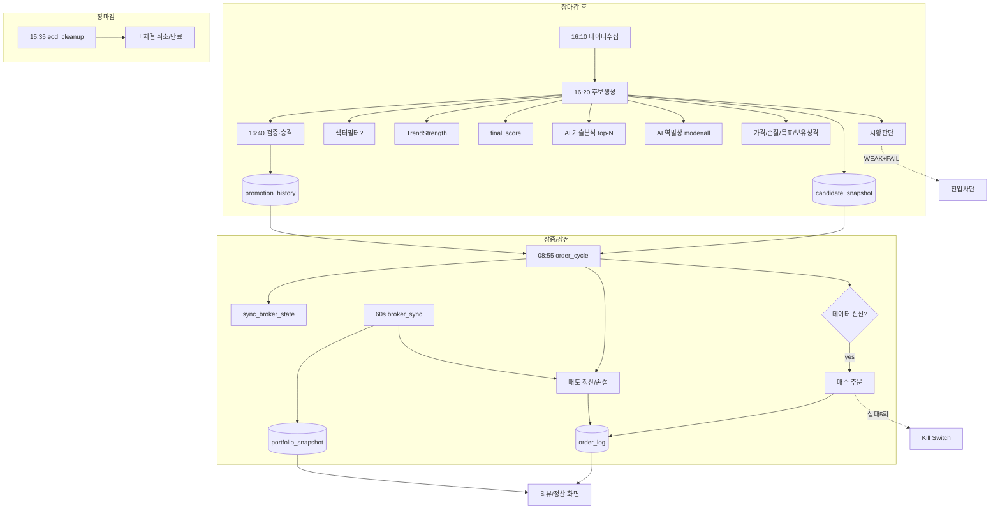

---

## 8. 프로세스별 구현 확인도 평가

| 프로세스 | 구현 확인 여부 | 완성도 | 코드 근거 | 확인 필요 사항 |
|---|---:|---:|---|---|
| 시장 데이터 수집 | 확인 | 높음 | `collector.py`, `krx_adapter.py` | 수정주가 폴백(Phase4) 미구현 |
| 시장 상황 판단 | 확인 | 높음 | `regime.py` | 결과 영속 저장 없음 |
| 업종/섹터 분석 | 일부 확인 | 중간 | `sector_selector.py` | 기본 비활성; 결과 저장 테이블 미확인 |
| 전략 선택 | 확인 | 높음 | `_RUNNABLE_STRATEGIES`, `entry_policy_for_strategy` | 개별 전략 신호 로직 상세 미열람 |
| 종목 선정/점수화 | 확인 | 높음 | `universe_filter.py`, `scoring.py`, `_save_candidate_snapshot` | StrategyAware 일부 컴포넌트 중립 placeholder |
| AI 기술분석 | 확인 | 중간 | `technical_scorer.py` | 기본 비활성, 실 Bedrock 응답 미검증 |
| AI 역발상 | 확인 | 중간 | `contrarian_analyzer.py` | mode=all+enabled 동시 필요 |
| 가치/목표가/손절 | 확인 | 중간 | `price_calculator.py`, `live_rules.py`, `valuation_margin.py` | 펀더멘털 데이터 적재 의존 |
| 검증·승격 | 확인 | 높음 | `validation/*`, `gate.py` | 히스토리 백필 선행 필요 |
| 매수 판단/주문 | 확인 | 높음 | `_submit_candidate_orders`, `order_manager.py` | 실주문은 live 플래그 의존 |
| 매도 판단/주문 | 확인 | 높음 | `_submit_exit_orders` | 진입가 복원 폴백 의존 |
| 체결 반영 | 확인 | 높음 | `sync_broker_state` | KIS daily CCLD 누락 폴백 다수 |
| 리뷰/복기 | 확인 | 중간 | `api/trade_review.py`, `reconciliation.py` | estimated_exit 추정 로직 |
| 리스크/Kill Switch | 확인 | 높음 | `risk/manager.py` | 섹터/테마 한도 기본 비활성 |

---

## 9. 누락 또는 미구현 의심 영역

### 9.1 구현 확인됨
- 데이터 수집, 시황 판단, 후보 점수화, 검증·승격, 매수/매도 주문, 체결 동기화, Kill Switch, 거래 리뷰/정산, 스케줄러 7잡, KIS REST 흐름 골격.

### 9.2 일부 구현됨
- 섹터 필터/Kostolany 섹터 모드(기본 비활성, 결과 영속화 미확인).
- StrategyAware 점수의 일부 컴포넌트(institutional_foreign_flow, earnings_revision 등)는 중립 placeholder(`_normalize` default 50) — 실데이터 소스 미연결.
- Kostolany 시황 composite(`MarketRegimeInput`)의 매크로/수급/심리 입력은 placeholder provider(`PlaceholderKostolanyDataProvider.enrich`가 그대로 반환).
- 수정주가 broker 폴백(`collector.py:62-64`) — 주석상 Phase 4 미구현.

### 9.3 미구현 또는 확인 불가
- 뉴스 API / Email / Telegram 알림 — 코드 경로 없음.
- OS 레벨 cron / Windows Task / shell·batch 스크립트 — 미확인.
- 독립 CLI/`run.py` — 미확인.
- 키움(`KiwoomAdapter`) 실호출 흐름 상세 — 미열람.

### 9.4 외부 설정 또는 운영 환경 확인 필요
- `.env` 실제 값: `MAPS_LIVE_TRADING_ENABLED`, `MAPS_BROKER_MODE`, `KIS_REAL_TRADING`, `MAPS_CONFIRM_REAL_TRADING`, `MAPS_DRY_RUN`, `MAPS_SCHEDULER_ENABLED`.
- 자격증명: `KIS_APP_KEY/SECRET/ACCOUNT_NO`, `AWS_ACCESS_KEY_ID/SECRET`, `SLACK_WEBHOOK_URL`.
- 실 운영 DB(SQLite vs PostgreSQL), 스케줄 시각 override, `MAPS_STOCK_REPORT_PATH`.
- DART API 키·엔드포인트 정책, KIS/Kiwoom 에러코드 전체 매핑.

---

## 10. 개선 후보 (분리 — 본문 미반영)

> 아래는 코드 수정 없이 식별만 한 개선 후보다.

- **프로세스 단절 구간**: 시황(`RegimeResult`)·섹터 선정 결과가 DB 영속화되지 않아 사후 추적/리플레이가 어렵다.
- **로그 부족**: 시황·섹터 결정은 잡 details/INFO 로그에만 존재 → 별도 audit 테이블 부재.
- **예외 처리 광범위 `except Exception`**: `_save_candidate_snapshot`의 TS/AI/가격 산출이 광범위 except로 원인 은닉 가능.
- **재처리 어려움**: 매수 후보 주문 실패 후 부분 진행 시 idempotent 재실행 보장은 중복가드(`order_log` 상태)에 의존 — 재처리 절차 문서화 부재.
- **전략 모듈 결합도**: `_RUNNABLE_STRATEGIES`·`STRATEGY_GROUP_MAP`·`live_rules._STOP_LOSS_PCTS`·`scoring` 가중치가 4곳에 분산 — 전략 추가 시 동기화 필요.
- **테스트 부족 의심**: StrategyAware/AI placeholder 컴포넌트의 실데이터 경로 미연결로 통합 테스트 범위 제한.
- **설정값/임계값**: 장세 분류(0.7/0.4), 변동성(12%/20%), 갭(2%), 노출(10%) 등 일부는 상수 하드코딩(`regime.py`, `universe_filter.py`).
- **DB 정합성 위험**: 체결 동기화의 다중 폴백(포지션 기반 매도 filled, expired 진입 복원)이 실제 체결가와 괴리 가능(estimated_exit 추정).
- **AI 검증 부족**: AI 점수/가격이 final_score·주문 지정가에 반영되나 응답 신뢰도 검증·로그 보존이 제한적.
- **주문 실행 안정성**: 장중 손절이 pykrx 15분 지연 현재가에 의존(`_fetch_intraday_prices`).
- **Dry-run/실주문 구분**: live 여부가 다중 플래그(`MAPS_LIVE_TRADING_ENABLED`+`MAPS_DRY_RUN`+`MAPS_BROKER_MODE`+`KIS_REAL_TRADING`) 조합 → 오설정 위험.
- **API Key/Secret 관리**: settings에 평문 필드(`kis_app_secret`, `aws_secret_access_key`) — 비밀관리(Secrets Manager 등) 미연동.
- **스케줄러 장애 추적**: APScheduler 잡 실패는 Slack `send_job_failed`로만 통지 → 잡 실행 이력 DB 미보존(마지막 run만 메모리).

---

## 11. 산출물 검증 체크리스트

- [x] 실제 Python 코드 기준으로만 작성되었는가? — 예(파일/함수/라인 근거 명시).
- [x] 신규 설계 내용이 섞이지 않았는가? — 예(개선안은 §10 분리).
- [x] 각 프로세스별 관련 파일·모듈·클래스·함수가 명시되었는가? — 예.
- [x] 실행 진입점이 명확히 정리되었는가? — 예(§1.1).
- [x] 스케줄러/배치/자동 실행 구조가 정리되었는가? — 예(§1.4, §5).
- [x] 데이터 저장 흐름이 확인 가능한 범위에서 정리되었는가? — 예(§3, 각 프로세스 6항).
- [x] 외부 API 연계가 분리되어 정리되었는가? — 예(§4).
- [x] AI 분석 연동 흐름이 확인 가능한 범위에서 정리되었는가? — 예(§2.5, §2.6).
- [x] 주문/체결/익절/손절 흐름이 구분되었는가? — 예(§2.9~2.12).
- [x] 운영자가 장애 시 확인할 수 있는 로그·확인 포인트가 정리되었는가? — 예(각 10항).
- [x] 확인 불가 항목이 "확인 필요"로 분리되었는가? — 예(§0, §9.4).
- [x] 개선 후보가 본문이 아닌 마지막 섹션에 분리되었는가? — 예(§10).

---

*본 문서는 정적 코드 분석 결과이며, 런타임 `.env`·외부 API 실응답·DB 실데이터는 반영하지 않았다. "확인 필요" 항목은 운영 환경 점검으로 보완해야 한다.*
